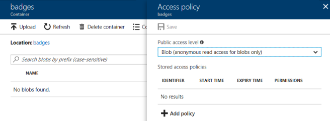
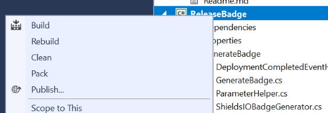
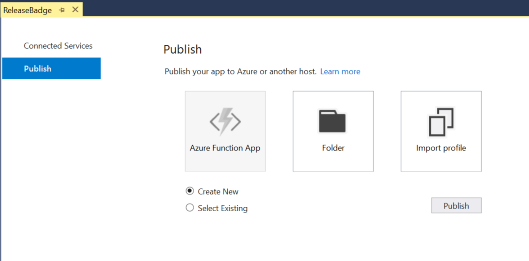
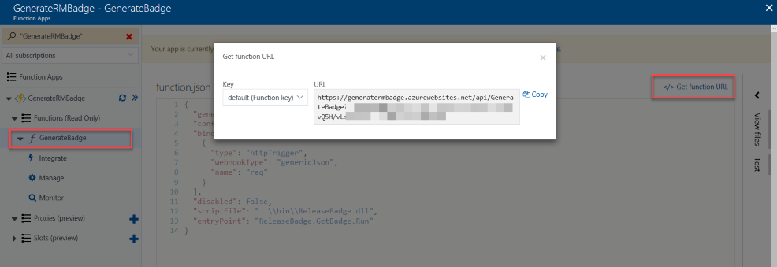
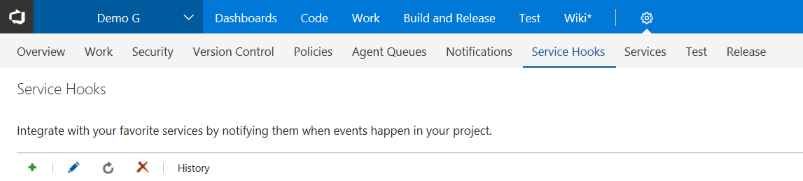
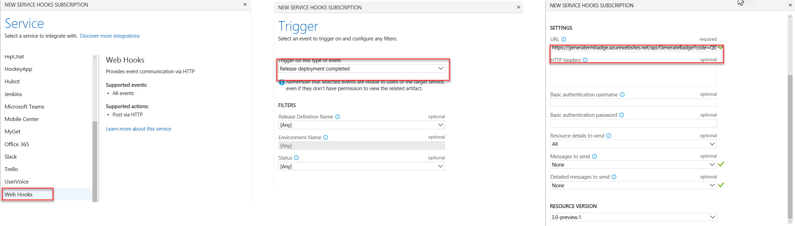

# Visual Studio Team Services Release badge generator function

Release badge generator is a simple [Azure Function](https://docs.microsoft.com/en-us/azure/azure-functions/functions-overview) that allows to generate [VSTS](https://www.visualstudio.com/team-services/)
releases badges on the cheap (unless a huge number of releases are involved the cost of running the service should be zero or close to zero)

A badge is an image (png, gif, svg) that can be embedded in a web page, it shows the release definition name and the release number on a given environment.


The release badge generator function uses [Shields IO](http://shields.io/) service to generate the badges, the badges are then stored on
[Azure Storage Container](https://docs.microsoft.com/en-us/azure/storage/blobs/storage-blobs-introduction) where they can be freely accessed
over HTTP/HTTPS by anyone.

Badges are generated in (near) real time when the function receives a [Release deployment completed event](https://docs.microsoft.com/vsts/service-hooks/events?toc=/vsts/integrate/toc.json&bc=/vsts/integrate/breadcrumb/toc.json#ms.vss-release.deployment-completed-event) from VSTS.

The service requires NO access to a VSTS account it merely generates the badge when the event is received, it's a totally stateless service it stores no information whatsoever about releases (unless we consider the badges information).

> This is a few hours hack, it was no knows issues but it comes with no warranties of reliability. For example it wasn't designed to work around the Shields IO service issues or unavailability there are not retries mechanisms besides the one that is offered by VSTS Service Hook retries mechanisms.

> This function is implemented in C# but it could be as easily implemented in JavaScript or [Java](https://docs.microsoft.com/en-us/azure/azure-functions/functions-create-first-java-maven)

## Badge styles

The badge can have three different colors depending on the status (by default only sucessfull deploys generate a badge)

* **succeeded** Green
* **Partially suceeded** Yellow
* **Failed** Red

## Requirements

In order to run this services you need two things

* An [Azure](https://azure.microsoft.com) account
* One or more [Visual Studio Team Services](https://www.visualstudio.com/team-services/) accounts.

> This hasn't been tested against Team Foundation Server but it should work.

### Running costs

The costs to run the service depends on the type of hosting you have chosen for the function, the amount of storage (and storage redundancy) used and the number of times the badges are served.

See

* [Azure Functions pricing](https://azure.microsoft.com/pricing/details/functions/)
* [Azure storage pricing](https://azure.microsoft.com/en-us/pricing/details/storage/blobs-general/)

For example you can host the function on a web application you already have (something you are already paying), create a new web app, or choosing a consumption plan in which you only pay for usage.

The consumption plan has a very generous monthly free grant (although it uses a storage account which is not free) which for badge generation purposes will never be hit unless you have a huge number of releases per month (by huge I mean over several hundred thousands of badge generations).

The cost of running this service will be hardly over a few cents per month if using a consumption plan (including storage)

## Installation

You can either manually provision the Azure resources neeeded to run the generator. The generator
needs the following resources

* A Function App to host the function, this may also create
  * A storage account (you can use an existing one)
  * A hosting plan (you can use an existing one)
* A storage account to hold the badges.
  * This storage needs to have a storage container named **badges** with a **blob (anonymous read access for blobs only** access policy.



The function needs to have a setting called _AzureWebJobsBadgesBlob_ with a connection string to the badges storage account. This can be done in either the [Application settings](https://docs.microsoft.com/azure/azure-functions/functions-how-to-use-azure-function-app-settings#settings) on the Azure portal for example or on the _host.json_ function file. (more on this later)


### Provisioning Azure Resources

You don't need to manually provision Azure resources, you just need to run the `Deploy-AzureResourceGroup.ps1` PowerShell file located on the `provision` folder to create all necessary Azure resources and create the `badges` container on the badges storage account with the appropriate permissions.

This script does two things
* Use an ARM template to either provision a dedicated function app (Azure App Service plan) or a consumption function (pay per use) app (this step is optional)
* Create a storage container in the badges storage account and sets the permission so anyone can read the badges.

> Learn more about [automating the deploy of an Azure function](https://docs.microsoft.com/en-us/azure/azure-functions/functions-infrastructure-as-code)

Make sure you are logged in to Azure (for example using  [Login-AzureRmAccount](https://docs.microsoft.com/en-us/powershell/azure/authenticate-azureps))
before executing the provided PowerShell script.

When running the `Deploy-AzureResourceGroup.ps1` passing a value on **HostType** parameter will trigger the creation of the Azure resources. This parameter has two possible values
* **Dedicated** to host the function in a dedicated web app
* **Consumption** to host the function on a consumption plan.

> If you skip the **HostType** parameter, no resources will be create. Only the storage container will be created.

This affects the ammount you may pay for using the Function. Learn more about the consequences of different hostng plans in [Azure Functions hosting plans comparison](https://docs.microsoft.com/azure/azure-functions/functions-scale)

The following parameters can be used to parameterize the resources that will be created:
* **ResourceGroupName** The name of the resource group
* **ResourceGroupLocation** The data center where the resources will be created. You can get the list of locations by running the PowerShell command
```ps1
Get-AzureRmLocation | select location
```
or the [Azure Command Line Interface](https://docs.microsoft.com/en-us/cli/azure/overview?view=azure-cli-latest) command
```
az account list-locations --output table
```
* **StorageAccountType** The type of storage to be used to store the functions. With possible values
  * Standard_LRS
  * Standard_GRS
  * Standard_RAGRS
  > This affects the [price](https://azure.microsoft.com/pricing/details/storage/blobs/) you will pay for storage and the [availability/redundancy](https://docs.microsoft.com/azure/storage/common/storage-redundancy) of data
* **BadgeStorageAccountType** The type of storage to be used to store badges (sames value set as **StorageAccountType**)
* **BadgesStorageAccountName** The name of the badges storage account, this name must be unique (across Azure) and will be used on the URL used to serve the badges. Eg if you choose _mybadges_ as the account name, the badges will be accesible on _ https://mybadges.blob.core.windows.net/badges_
* **HostingPlanName** (optional) The name of the hosting plan.
* **NoAnonymousAccess** Don't set badges storage container access level as anonynmous (only people with a token will be able to see the badges)
* **ValidateOnly** Only validates the changes, doesn't perform any.

If you are provisiniong a dedicated hosting ( **HostType** with value `Dedicated`) there are two additional (optional parameters)
* **SKU** Hosting plan size, this affects the [cost](https://azure.microsoft.com/pricing/details/app-service/) of running the service. Possible values (default value `free`)
  * Free
  * Shared
  * Basic
  * Standard
* **WorkerSize** Scale the number of instances (default value `1`)

> Learn more about [Azure Resource Manager](https://docs.microsoft.com/en-us/azure/azure-resource-manager/resource-group-overview)

The ARM template also configures the function application setting _AzureWebJobsBadgesBlob_ with the connection string for the **BadgesStorageAccountName**

To provision a consuption function app you can use

```ps1
 .\Deploy-AzureResourceGroup.ps1  -ResourceGroupName GenerateRMBadge -ResourceGroupLocation "South Central US" -StorageAccountType Standard_LRS -BadgeStorageAccountType Standard_LRS -B
adgesStorageAccountName "tspbadgesconsumption"  -AppName GenerateRMBadge -HostType Consumption
```

### Deploying

After the Azure Function has been provisioned in Azure you can deploy the code using Visual Studio Deploy





But you should automate build and deployment using your favorite tool of choice and don't deploy it directly from an IDE.

Learn how you can setup [Continuous deployment for Azure Functions](https://docs.microsoft.com/azure/azure-functions/functions-continuous-deployment) using Azure built in mechanism or using [VSTS](https://blogs.msdn.microsoft.com/appserviceteam/2017/06/01/deploying-visual-studio-2017-function-projects-with-vsts/)

### Configuring VSTS Web Hook

In order to generate badges we need to configure one (or more) VSTS web hooks. The first thing we need to do is fetch the URL for the **GenerateBadge** Function (for example you can get it on Azure portal)



Once we have the URL, configure a Service hook, on the VSTS team project admin page)



The Service hook needs to be configured with the following settings
* **Service** Web Hooks
* **Trigger** Release deployment completed
* **URL** The URL of the GenerateBadge Azure Function
* **Resource Details to send** All
* **Messages to send** None (in fact this value doesn't matter, but we might as well save some bandwitdh)
* **Detailed messages to send** None  (in fact this value doesn't matter, but we might as well save some bandwitdh)



### Parameterizing badges generation

There are three ways to parameterize badge generations, the first one is via HTTP headers. You can configure HTTP headers on the service hook itself.


This allows to have specific parameters for different service hooks, if no parameter is overriden via an HTTP header than the generator uses the parameter defined at the function level (`host.json`) or via Application settings. If no parameter is defined, then the default value is used.

This allows to have parameters specific to service hooks and general parameters at the function level (HTTP headers override function settings)

#### Parameters


|             Parameter             |                                                                                                                                                                                     Description                                                                                                                                                                                      | Application Setting Name |             HTTP Header             | Default Value |
| --------------------------------- | ------------------------------------------------------------------------------------------------------------------------------------------------------------------------------------------------------------------------------------------------------------------------------------------------------------------------------------------------------------------------------------ | ------------------------ | ----------------------------------- | ------------- |
| Enable All Status (true or false) | Generate a badge for all status. By default only sucessfull deploys generate a badge.                                                                                                                                                                                                                                                                                                | EnableForAllStatus       | X-EnableForAllStatus                | false         |
| Badge Style                       | Define the style of the badge. Styles defined by [Shields IO](http://shields.io/)  (plastic,flat,flat-squared)                                                                                                                                                                                                                                                                       | Style                    | X-Style                             |               |
| Badge File Type                   | The type of file to generate (png,gif,svg,...) see [Shields IO](http://shields.io/) docs for complete list                                                                                                                                                                                                                                                                           | FileType                 | X-FileType                          | png           |
| Release Definition friendly name  | Override the definition name (for the badge filename). This only makes sense if you have one service hook per release definition.                                                                                                                                                                                                                                                    |                          | X-ReleaseDefinitionFileFriendlyName | false         |
| Cache Max Age (minutes)           | Sets the badge max age cache on the client browser. The bigger the cache duration, the less costs you incur in traffice (at the cost of the possibility of a repeat user seeing an outdated badge). Badges sizes are small, unless you have tens of millions accesses there should be no extra cost in data transfers. You should adjust this to the expected frequency of releases. | MaxAge                   | X-MaxAge                            | 15 minutes    |
| Use release name (true or false)  | Use relase name as part of the filename instead of the release id. While the release name will make it easier to reference badges it also means you may have to rewrite references to badges if the release definition name is changed.                                                                                                                                              | UseReleaseName           | X-UseReleaseName                    | false         |


## Accessing badges

Once a badge is generated it is stored in the `badges` storage container with the following structure

badges/{team project identifier}/{release identifier or name}-{environment name}.{file type extension}

* **{team project identifier}** To get the team projet identifier you can use the [APP](https://www.visualstudio.com/docs/integrate/api/tfs/projects#get-a-team-project) enter following URL in a browser `https://{instance}/DefaultCollection/_apis/projects/{project}` (whereas `project` is the project name). Get the id from the returned message. (it's a GUID)
* **release identifier or name** This value depends on the configuration. If
  * **Release Definition friendly name** if defined this value will be used.
  * **Use release name** is enabled then the release name will be used
  * Otherwise the release identifier is used. To get the release identifier you can the [API to get the list](https://www.visualstudio.com/docs/integrate/api/rm/definitions#get-a-list-of-release-definitions) of release definitions by entering the url in the browser https://{account}.vsrm.visualstudio.com/{project}/_apis/release/definitions and get the release id (a numeric value) for the release definition you want to get the badge.

After generated the badge is available via HTTP/HTTPS via the url http://{storage accounturl}/badges/{team project identifier}/{release identifier or name}-{environment name}.{file type extension}

Example

`https://tspbadgesconsumption.blob.core.windows.net/badges/4ffd7d95-462b-4473-85cc-f4a987227d72/2-Production.png`


> All team project are stored in a single folder so it's easy to delete them.

## License

All code is coyrighted by Tiago Pascoal and licensed under a [MIT license](LICENSE)